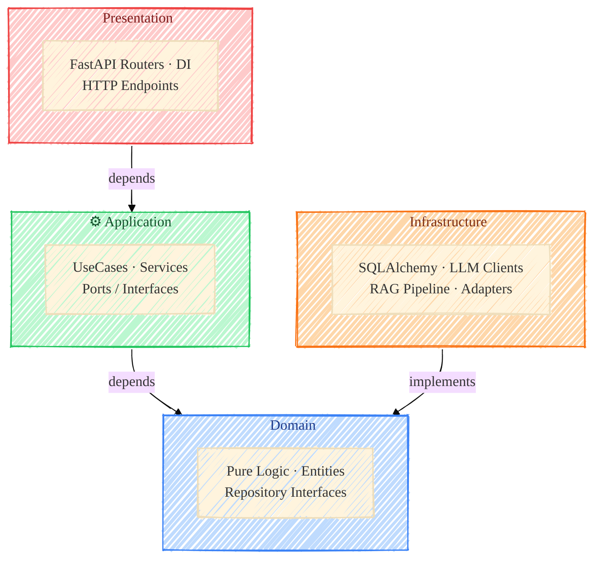

# Clean Architecture (Layer Dependencies)

Four-layer architecture: Presentation depends on Application, which depends on Domain. Infrastructure implements Domain interfaces.

## Diagram

```mermaid
%%{init: {"theme": "base", "look": "handDrawn", "themeVariables": {"fontFamily": "Comic Sans MS"}}}%%
flowchart TD
    subgraph PRES ["📱 Presentation"]
        P["FastAPI Routers · DI<br/>HTTP Endpoints"]
    end
    subgraph APP ["⚙️ Application"]
        A["UseCases · Services<br/>Ports / Interfaces"]
    end
    subgraph DOM ["🧩 Domain"]
        D["Pure Logic · Entities<br/>Repository Interfaces"]
    end
    subgraph INFRA ["🔧 Infrastructure"]
        I["SQLAlchemy · LLM Clients<br/>RAG Pipeline · Adapters"]
    end

    PRES -->|depends| APP
    APP -->|depends| DOM
    INFRA -->|implements| DOM

    style PRES fill:#fecaca,stroke:#ef4444,color:#7f1d1d
    style APP fill:#bbf7d0,stroke:#22c55e,color:#14532d
    style DOM fill:#bfdbfe,stroke:#3b82f6,color:#1e3a8a
    style INFRA fill:#fed7aa,stroke:#f97316,color:#7c2d12
```
